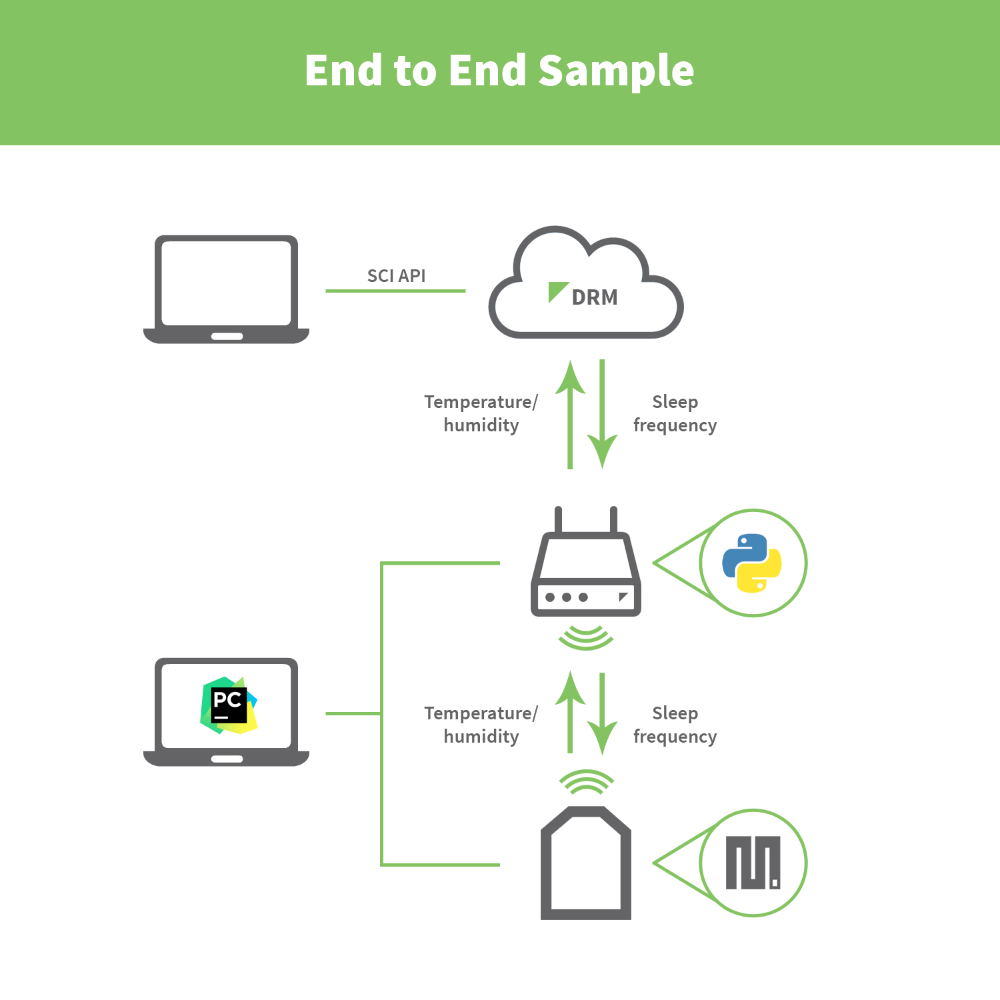

End to End Sample Application
=============================

This sample Python application shows how to use the XBee Gateway to transmit
data from XBee nodes of the network to Digi Remote Manager and vice versa.

The example registers a callback to process data (temperature and humidity)
received from XBee nodes joined to the network and uploads it to Digi Remote
Manager through data streams. In addition, it registers another callback to
process device requests coming from the cloud and transmit the data to the
appropriate XBee node, allowing to change the its sleep frequency or disable
the temperature/humidity service running on the target MicroPython environment
remotely.

Requirements
------------
To run this example you will need:

* An XBee Gateway device.
* At least one XBee 3 radio module with MicroPython support and its
  corresponding carrier board (XBIB-C board).
* A Digi Remote Manager account with your XBee Gateway added to it.
  Go to https://myaccount.digi.com/ to create it if you do not have one.
* Another instance of PyCharm with the **End to End** sample for MicroPython
  loaded (located in the *DEMOS* category).

Setup
-----
1. Plug the XBee radios into the XBee adapters and connect them to your
   computer's USB or serial port.

2. Ensure that the modules are on the same network as the gateway.

Run
---
The example is already configured, so all you need to do is to build and run
the project. Then, launch the **End to End** sample for MicroPython in the XBee
modules that form the network.

To verify the application is working properly, check the following:

1. Every 10 seconds, a new line is printed out in the console per each XBee
   module running the MicroPython example:

       RF data received from 0013A200XXXXXXXX >> XX.X@@@XX.X

2. In your Digi Remote Manager account, go to **Data Services > Data Streams**
   and verify that every XBee module in the network has its own *temperature*
   and *humidity* data stream, containing the values read from the sensor.

3. Go to **Documentation > API Explorer**, paste and complete the following
   request to communicate with a specific XBee device of the network and click
   **Send**.

       <sci_request version="1.0">
         <data_service>
           <targets>
             <device id="00000000-00000000-XXXXXXXX-XXXXXXXX"/>
           </targets>
           <requests>
             <device_request target_name="tempHum">
               0013A200XXXXXXXX@@@0
             </device_request>
           </requests>
         </data_service>
       </sci_request>

   where:

     - `00000000-00000000-XXXXXXXX-XXXXXXXX` is the device ID of your XBee
       gateway.
     - `0013A200XXXXXXXX` is the MAC address of the XBee device you want to
       send the data to.
     - `0` is the request you want to send to the device. You can enter any
       positive integer to change the XBee sleep frequency (`0` stops the
       service and avoids the XBee from sleeping).

4. Verify that a new line is printed out in the console with the following
   message:

       Device request received with target xbee >> 0013A200XXXXXXXX@@@0

   After a few seconds, the XBee device should stop sending the temperature and
   humidity values.

5. Send a new device request from Digi Remote Manager with `5` as payload
   and verify that the XBee device starts sending the readings again.

Supported platforms
-------------------
* Digi IX15 XBee Gateway

License
-------
Copyright (c) 2020, Digi International, Inc.

Permission is hereby granted, free of charge, to any person obtaining a copy
of this software and associated documentation files (the "Software"), to deal
in the Software without restriction, including without limitation the rights
to use, copy, modify, merge, publish, distribute, sublicense, and/or sell
copies of the Software, and to permit persons to whom the Software is
furnished to do so, subject to the following conditions:

The above copyright notice and this permission notice shall be included in all
copies or substantial portions of the Software.

THE SOFTWARE IS PROVIDED "AS IS", WITHOUT WARRANTY OF ANY KIND, EXPRESS OR
IMPLIED, INCLUDING BUT NOT LIMITED TO THE WARRANTIES OF MERCHANTABILITY,
FITNESS FOR A PARTICULAR PURPOSE AND NONINFRINGEMENT. IN NO EVENT SHALL THE
AUTHORS OR COPYRIGHT HOLDERS BE LIABLE FOR ANY CLAIM, DAMAGES OR OTHER
LIABILITY, WHETHER IN AN ACTION OF CONTRACT, TORT OR OTHERWISE, ARISING FROM,
OUT OF OR IN CONNECTION WITH THE SOFTWARE OR THE USE OR OTHER DEALINGS IN THE
SOFTWARE.